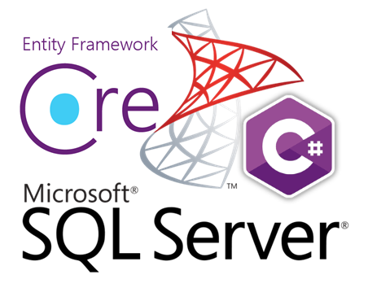

# Microsoft NorthWind database 2020 Part 1

Microsoft created [Northwind database](https://github.com/Microsoft/sql-server-samples/tree/master/samples/databases/northwind-pubs) many years ago which has assisted countless developers to work with Microsoft SQL-Server. There are several elements of the database model and table structures which needed improvement which the current version presented in this repository has updated.

For demonstrating working with the new model a C# Windows form project uses [Microsoft Entity Framework Core](https://docs.microsoft.com/en-us/ef/core/) 3.x to present data. 

### Important
Current code samples are not production ready, these codes samples are to validate the database model translates properly to code hence the work "test" in form names.

### Simplified model
A simplified model can be [found here](https://github.com/karenpayneoregon/NorthWind2020-scripts/blob/master/README.md) (better than the original) for those developers who want a minor upgrade such as tables with no spaces in their name and proper primary keys.

### Microsoft TechNet article
Coming shortly

### See also

- [Get the sample databases](https://docs.microsoft.com/en-us/dotnet/framework/data/adonet/sql/linq/downloading-sample-databases)

### Current model

